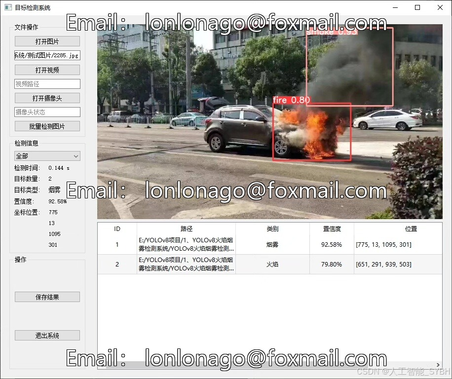
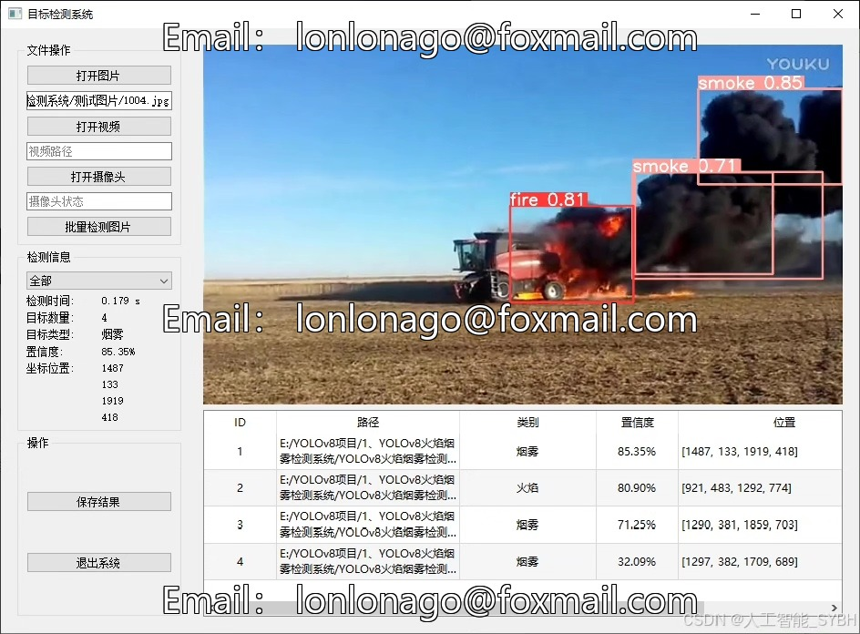
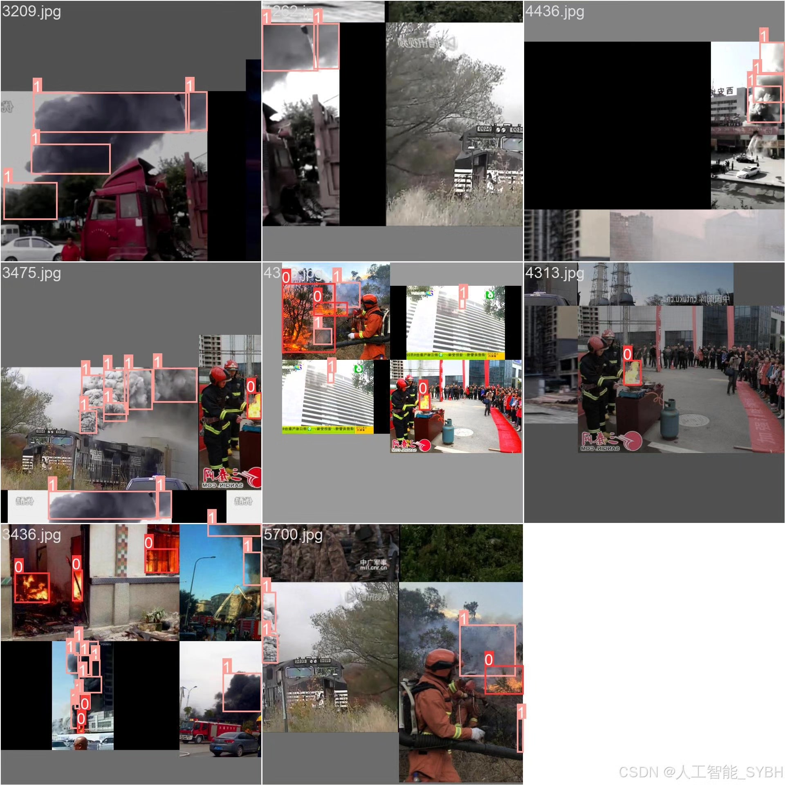
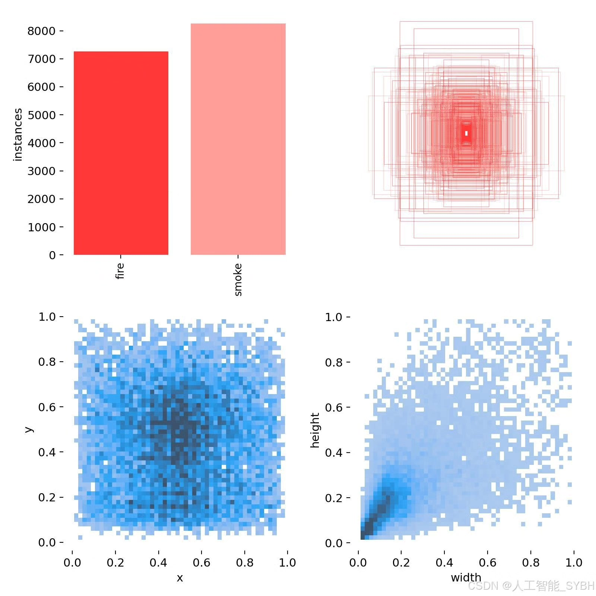
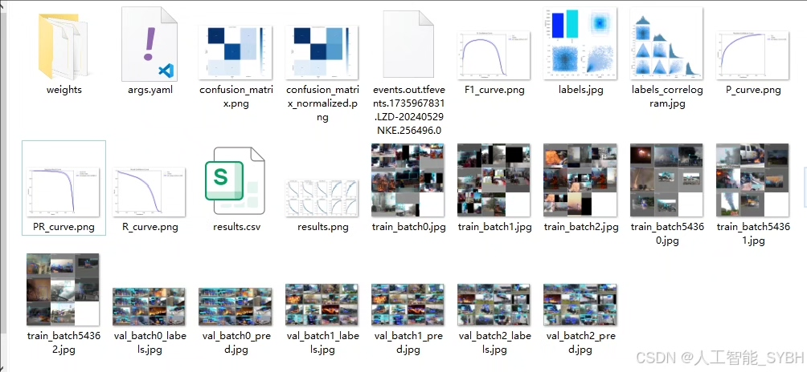
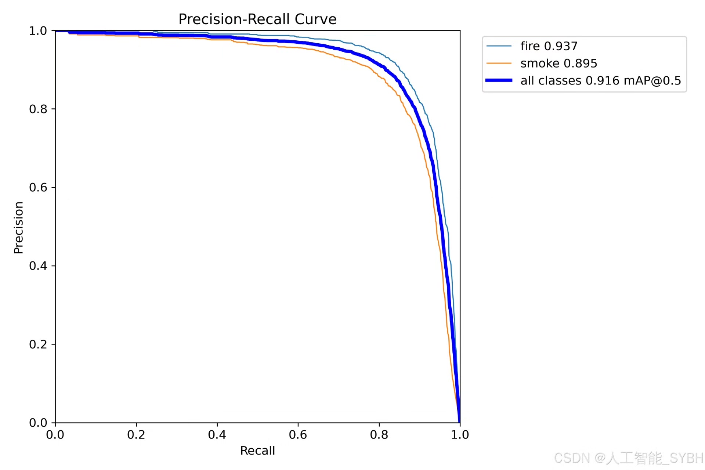
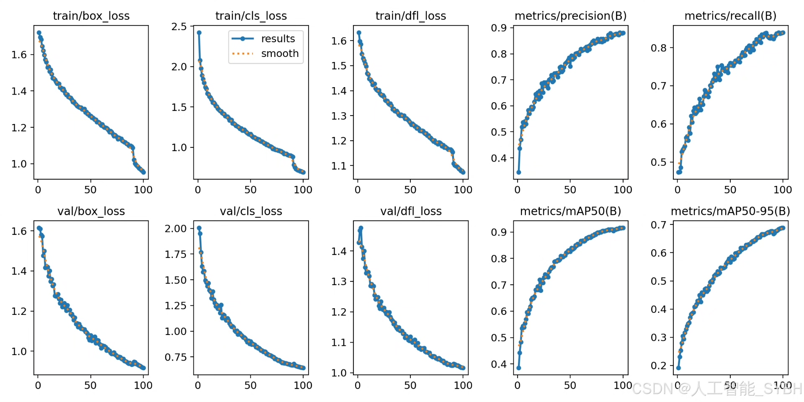
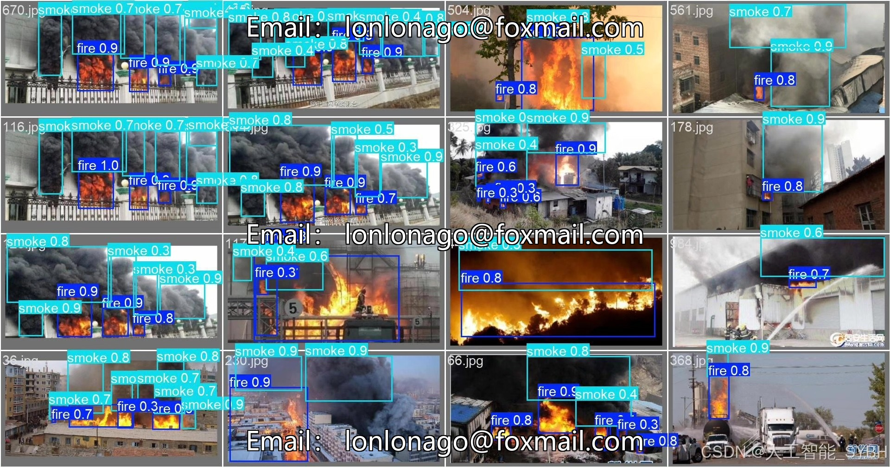

# Based on Deep Learning, a Fire Smoke Detection System (YOLOv8+YOLO dataset)

## Body

Based on the advanced YOLOv8 object detection algorithm, this project has developed a highly efficient and accurate fire and smoke detection system. The system is specifically optimized for two types of targets ('fire' and 'smoke'), using a dataset containing 6744 images (4832 training images, 1000 validation images, and 912 test images). The model is trained and evaluated using this dataset. This system can detect fires and smoke in real-time in surveillance videos or static images, providing an intelligent solution for fire warnings. Through the application of deep learning technology, this system achieves practical detection accuracy and speed, which can be widely applied in forest fire prevention, industrial safety monitoring, smart home applications, and other fields.

The company's products have obtained the official commercial license certification from YOLO.

We provide after-sales service.

After payment, we will provide WeChat ID to answer questions anytime.

Environmental configuration: We will provide a tutorial on environmental configuration, and WeChat will provide answers.

Remote installation service: If you need remote configuration, additional payment of 69 is required, with all fees refunded if the configuration fails (only refund installation fees for older computers).

Retraining dataset: After setting up the environment, you can train on your own computer. If you need us to retrain, just pay 69 plus computing power fees (2.5 yuan/hour).

Full after-sales service

## Images

## Payment

Here is a pay link on Stripe ( https://buy.stripe.com/3cs8yP7sY87d0vu9AB ). Please contact me lonlonago@foxmail.com after funding $89, and I will send you a complete data files , thank you!

